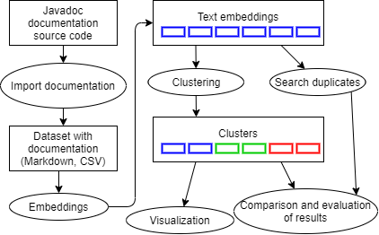
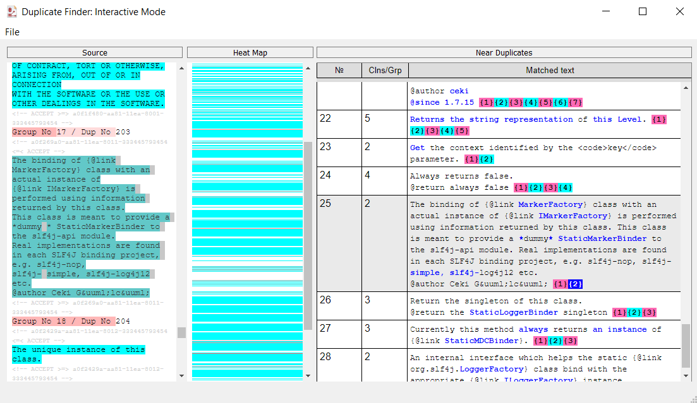

# clustering-algorithms

During software product lifecycle, the software documentation of changes significantly. Copy-pasting and partial modifications of replicated text fragments increase number of errors and mismatchings. Tracking such changes allows increasing the quality of documentation significantly. The main topic of this exepiments is to study the application of different word embeddings and clustering algorithms in the field of near duplicates in the software documentation.

### Description



* jd2md.py - create markdown from Javadoc
```sh
jd2md.py . XXXXX.clean.markdown
```
* load_and_report.py - add markers for clean text. If there was a marker before, it saves it
```sh
python load_and_report.py XXXX.clean.markdown XXXXX.tmp.markdown
```
* _I_marked2csv.py - create csv file from markdown with markers for clustering. If fragments of text are marked with a marker as a duplicate, then they will be marked with one number in csv. If the text fragment does not have a duplicate, it will be assigned a negative number.
```sh
python _I_marked2csv.py XXXXX.tmp.markdown XXXXX.csv
```
* _I_gridmertxt2md.py - from txt file documentation to markdown
```sh
python _I_gridmertxt2md.py XXX.txt XXXXX.markdown
```
* _I_csv2marked.py - from csv cluster file to markdown for DF
```sh
python _I_csv2marked.py XXX.csv XXXXX.markdown
```

### Experiments

* Clustering.ipynb - clustering data experiments. To start create a csv marked file with _I_marked2csv.py
* Embed_docs.ipynb - experiments with embeddings for each benchmarking documents 
* Embed_dataset.ipynb - experiments with embeddings for dataset what include data from all benchmarking documents. 
* getTime.ipynb - experiments of time evaluation.

### Visualization


For visualization use the Duplicate Finder tool https://docline.github.io/index.en. The file received after clustering is fed to the input of DF. Create cluster .csv file (def create_csv) after clustering and use _I_csv2marked.py to create an input markdown.

### Data
For the experiments were used labeled documents.
* SLF4J API docs, two snapshots:
    1. Commit `7c2f6cd1` as doi:10.1007/978-3-319-56856-0_2 → http://se.labri.fr/a/ICSR17-oumaziz/ states
    2. Tag `v_1.7.26` — last stable release as for 2019-07-06
* Mockito API docs, two snapshots:
    1. Commit `196ff979` as doi:10.1007/978-3-319-56856-0_2 → http://se.labri.fr/a/ICSR17-oumaziz/ states
    2. Tag `v2.28.2` — last stable release as for 2019-07-06
    JavaDocs captured from `src/main` directory
* [Google GSON](https://github.com/google/gson) API docs, two snapshots:
    1. Commit `2b08c88c` as doi:10.1007/978-3-319-56856-0_2 ? http://se.labri.fr/a/ICSR17-oumaziz/ states
    2. Tag `gson-parent-2.8.6` ó last stable release as for 2019-12-05
    JavaDocs captured from `gson/src/main/java/com/google/gson` directory
* JUnit 4 API docs, two snapshots:
    1. Commit `9e98a85e` as doi:10.1007/978-3-319-56856-0_2 → http://se.labri.fr/a/ICSR17-oumaziz/ states
    2. Tag `r4.13-beta-3` — last release as for 2019-07-06. Stable release 4.12 was long ago on 2014-12-04
    JavaDocs captured from `src/main` directory

To receive unmarked documents use:
```sh
1. https://se.labri.fr/a/ICSR17-oumaziz/
2. git clone ...
3. git checkout ... (commit hash)
4. Go to the specified directory
5. jd2md.py . XXXXX.clean.markdown
6. python load_and_report.py XXXX.clean.markdown XXXXX.tmp.markdown
7. python _I_marked2csv.py XXXXX.tmp.markdown XXXXX.csv
```
